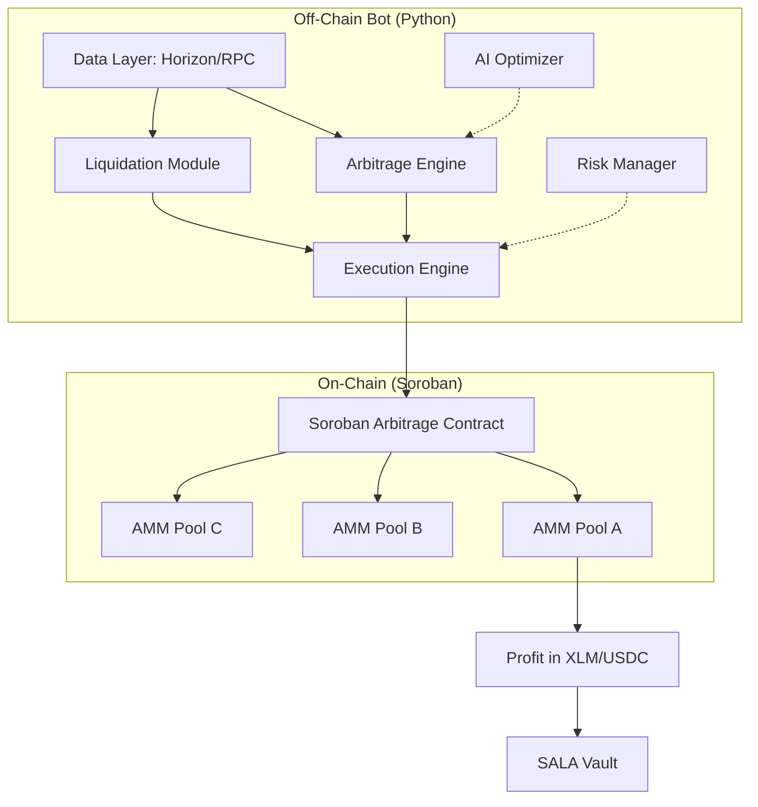

# Stellar Arbitrage & Liquidation Assistant (SALA)

## System Architecture

## Components

### 1. Soroban Smart Contract (`contracts/arb_executor`)
- **Atomic Execution**: Performs multiple swaps in a single transaction.
- **Slippage Check**: Reverts if the final output is less than the expected minimum.
- **Vault Integration**: Transfers profits to a designated vault.

### 2. Data Layer (`bot/data_layer.py`)
- Fetches pool reserves and order books using Stellar SDK and Horizon/RPC.
- Caches data in memory for sub-millisecond access.

### 3. Arbitrage Engine (`bot/arb_engine.py`)
- **Triangular Arbitrage**: XLM -> USDC -> BTC -> XLM.
- **Cross-Pool Arbitrage**: Buying on Pool A and selling on Pool B.
- Uses Bellman-Ford or simple cycle detection for profit identification.

### 4. Liquidation Module (`bot/liquidation_module.py`)
- Monitors lending protocols (e.g., simulated or integrated protocols like Comet).
- Triggers `liquidate` calls when health factor < 1.0.

### 5. Execution Engine (`bot/execution_engine.py`)
- Builds and signs Soroban transactions.
- Handles atomic bundling.

### 6. Risk Management (`bot/risk_manager.py`)
- Max exposure per trade.
- Circuit breaker for failed trades.

### 7. AI Layer (`bot/ai_optimizer.py`)
- Heuristic-based pool prioritization.
- Volatility tracking to adjust risk buffers.
