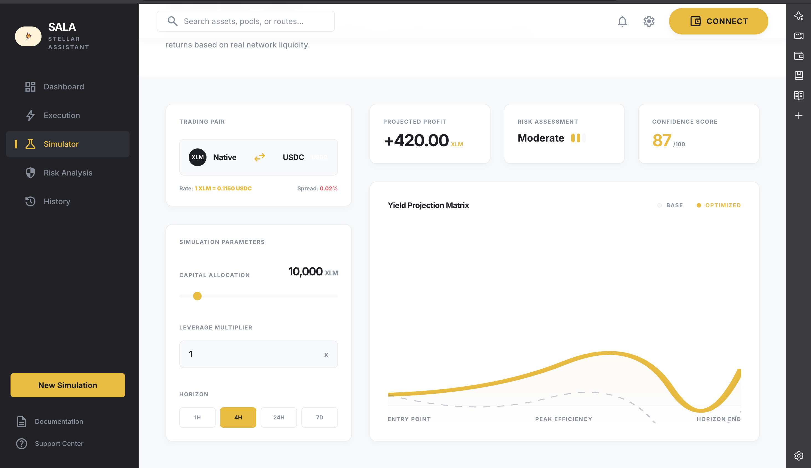
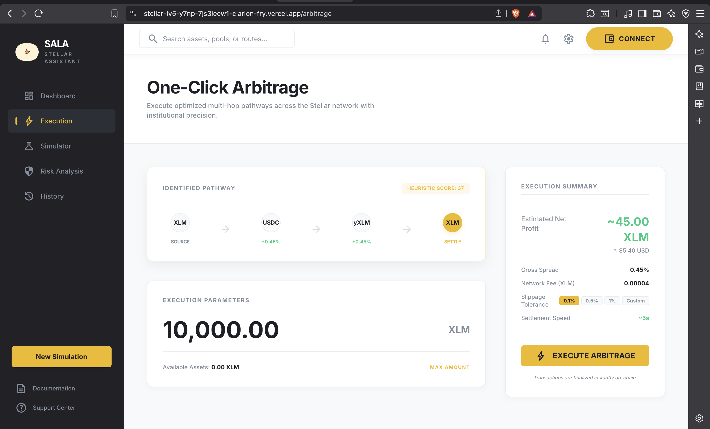
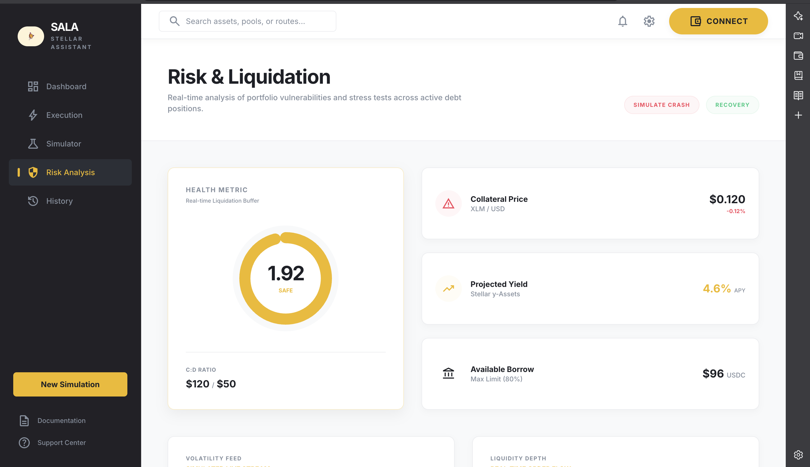
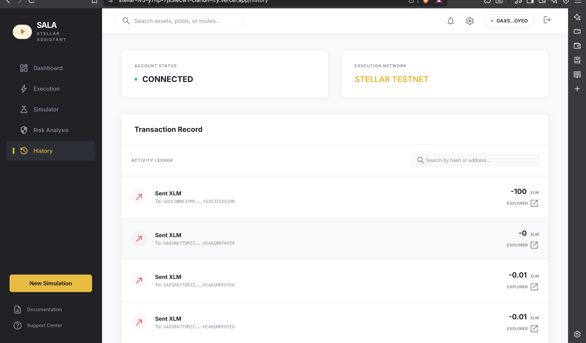
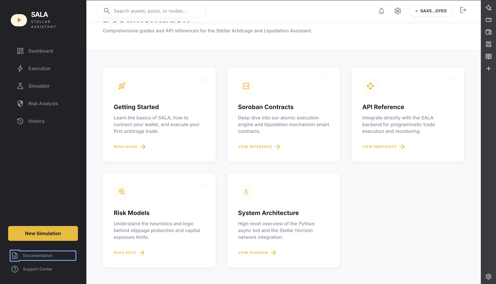
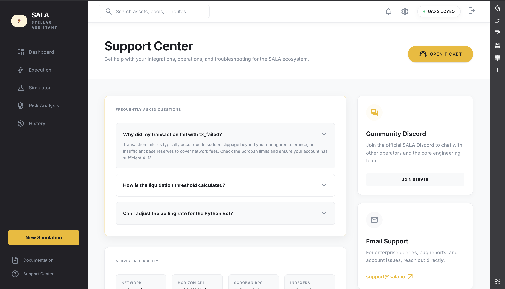
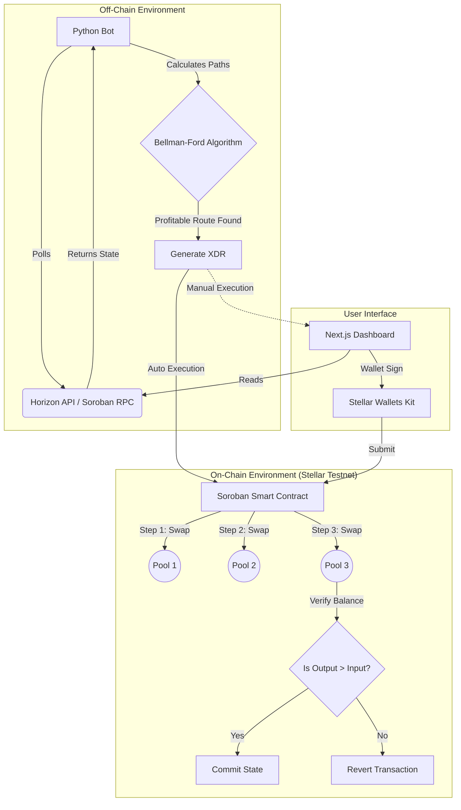

<div align="center">
  
  
  <br />
  <br />

# 🌌 SALA: Stellar Arbitrage & Liquidation Assistant

**Elevating Capital Efficiency on Stellar with AI-Driven Atomic Arbitrage and Automated Liquidations.**

[](https://stellar.org)
[](https://soroban.stellar.org)
[](https://nextjs.org/)
[](https://python.org)
[](LICENSE)

</div>

<hr />

## 🎯 Project Overview

**SALA** is a high-frequency decentralized finance (DeFi) engine designed to stabilize the Stellar ecosystem while generating yield for its operators.

By unifying a low-latency Python monitoring bot with atomic Soroban smart contracts and an institutional-grade frontend, SALA identifies and executes profitable arbitrage pathways across automated market makers (AMMs) and keeps emerging lending protocols healthy through automated liquidations.

### 🚩 The Problem

As DeFi on Stellar grows, fragmented liquidity across various AMM pools inevitably leads to price discrepancies. Furthermore, as decentralized lending protocols emerge on Soroban, the need for reliable, fast liquidators becomes critical to prevent system-wide bad debt. Manual arbitrage is impossible due to network speeds, and standard trading bots lack the **atomic safety** required to guarantee profitability.

### 💡 The Solution

SALA provides a **unified execution layer**:

1. **Off-Chain Intelligence**: A Python engine scans the network in sub-milliseconds for triangular and cross-pool opportunities using graph algorithms.
2. **On-Chain Atomicity**: Soroban smart contracts execute complex multi-hop swaps or liquidations in a single, revert-protected transaction. If the final output isn't profitable, the transaction reverts.
3. **Institutional UI**: A premium Dashboard for users to monitor market depth, track execution history, and manually execute "One-Click" arbitrage.

<div align="center">
  <table>
    <tr>
      <td align="center"><b>Profit Simulator</b><br/></td>
      <td align="center"><b>Execution Engine</b><br/></td>
    </tr>
    <tr>
      <td align="center"><b>Risk Analysis</b><br/></td>
      <td align="center"><b>Transaction History</b><br/></td>
    </tr>
    <tr>
      <td align="center"><b>Documentation</b><br/></td>
      <td align="center"><b>Support Center</b><br/></td>
    </tr>
  </table>
</div>

---

## ✨ Key Features

- 🛡️ **Institutional-Grade Safety**: Full access control, custom error handling, and a contract-level circuit breaker (pause mechanism).
- ⚡️ **Atomic Arbitrage**: Multi-hop swaps (e.g., `XLM -> USDC -> AQUA -> XLM`) that guarantee profitability or revert the transaction.
- 🧠 **AI-Optimized Routing**: Intelligent heuristics that prioritize liquidity pools based on historical volatility and order book depth.
- 🛡️ **Liquidation Module**: Real-time health factor monitoring for overcollateralized lending positions, with one-click liquidation triggers.
- 📊 **Institutional Dashboard**: Real-time asset valuation, interactive route analysis, and deep ledger history visualization.
- 👛 **Seamless Wallet Integration**: Native support for Freighter, Albedo, and xBull via Stellar Wallets Kit.

---

## 🏗 Detailed Architecture

SALA is architected as a **Hybrid High-Frequency DeFi Engine**, splitting responsibilities between a low-latency off-chain environment and a secure, atomic on-chain execution layer.

### 1. Off-Chain Intelligence (Python Engine)

The core logic resides in a modular Python engine designed for sub-millisecond opportunity detection:

- **📡 Data Layer**: Connects to Horizon and Soroban RPC nodes via asynchronous streaming to maintain a real-time shadow-state of liquidity pool reserves.
- **🧠 Arbitrage Engine**: Implements a modified **Bellman-Ford Algorithm** to identify triangular arbitrage cycles (e.g., XLM → USDC → BTC → XLM) across the network graph.
- **🛡️ Risk Management**: Calculates slippage, network fees, and transaction success probability before committing capital.
- **⚙️ Execution Controller**: Generates base-64 encoded XDR transactions and manages autonomous submission or routes them to the dashboard for manual user approval.

### 2. On-Chain Atomicity (Soroban Smart Contracts)

Written in Rust, our Soroban contracts provide the final safety guarantee for all operations. The **ArbExecutor** contract is engineered for maximum quality and security:

- **🔐 Robust Access Control**: Uses Soroban's `require_auth` to ensure only the authorized admin can trigger swaps, liquidations, or withdrawals.
- **⚡ Atomic Swaps**: Executes multi-hop swaps in a single transaction. If any leg of the trade fails or the final balance is lower than the initial investment, the entire transaction **reverts** with custom error codes (e.g., `InsufficientProfit`).
- **🛑 Circuit Breaker**: Includes a `set_paused` mechanism that allows the admin to instantly stop all contract operations in case of extreme market volatility or protocol emergency.
- **🔗 Protocol Integration**: Interacts directly with Stellar's native Liquidity Pools and Soroban-based AMMs through a unified, path-validated interface.
- **🚨 Liquidation Handler**: Validates health factors and executes atomic debt-repayment/collateral-claim cycles, returning rewards directly to the secure vault.

### 3. Institutional Frontend (Next.js Dashboard)

A professional-grade interface for monitoring and manual intervention:

- **📊 Live Monitoring**: Real-time visualization of market depth, pool reserves, and detected opportunities.
- **👛 Wallet Orchestration**: Utilizes the **Stellar Wallets Kit** to provide a seamless signing experience for Freighter, Albedo, and xBull wallets.
- **📜 Transparency Layer**: Decodes complex XDR strings into human-readable trade paths, allowing users to verify operations before signing.

---

### 🔄 The Arbitrage Lifecycle

1. **Detection**: Bot identifies a price discrepancy between Pool A and Pool B.
2. **Simulation**: The engine simulates the trade against the current ledger state to calculate expected profit.
3. **Execution**:
   - **Auto-Mode**: Bot submits signed XDR directly to the network.
   - **Manual-Mode**: Dashboard alerts the user and requests a wallet signature.
4. **Verification**: The Soroban contract performs a final balance check. If `Output < Input + Fee`, it triggers a panic to revert the state.



---

## 🛠 Tech Stack

| Domain              | Technologies                                                     |
| :------------------ | :--------------------------------------------------------------- |
| **Smart Contracts** | Rust, Soroban SDK v21                                            |
| **Backend Engine**  | Python 3.11, `stellar-sdk`, `asyncio`, `rich`                    |
| **Frontend App**    | Next.js 14 (App Router), TypeScript, Tailwind CSS, Framer Motion |
| **Blockchain Int.** | `@stellar/stellar-sdk`, `@creit.tech/stellar-wallets-kit`        |

---

## 🚀 Quick Start Guide

### 1. Frontend Dashboard

The frontend is built with Next.js and lives in the root directory.

```bash
# Install dependencies (legacy-peer-deps required for certain wallet adapters)
npm install --legacy-peer-deps

# Start the development server
npm run dev
```

_The app will be available at `http://localhost:3000`._

### 2. Smart Contracts (Soroban)

The contracts require the Rust toolchain and Soroban CLI.

```bash
cd contracts/arb_executor

# Build the WebAssembly binary
soroban contract build

# Deploy to testnet
soroban contract deploy \
  --wasm target/wasm32-unknown-unknown/release/arb_executor.wasm \
  --source alice \
  --network testnet
```

### 3. Python Bot

The backend engine requires Python 3.9+.

```bash
cd bot

# Create virtual environment and install requirements
python3 -m venv venv
source venv/bin/activate
pip install -r requirements.txt

# Run the monitoring engine
python main.py
```

---

## 👥 User Testers & Feedback

### 👤 Verified Beta Testers

| User Name          | User Email                   | User Wallet Address                                         |
| :----------------- | :--------------------------- | :---------------------------------------------------------- |
| Swarupa Saha       | swarupasaha78@gmail.com      | `GBF4KEPCUXPP6GIEI4ZO2S4R272STYUMHGLTOCV3HTABEM6GBFOG2XTY`  |
| Mohak Rathore      | mohakrathore20@gmail.com     | `GDPBEU2RHH43OFAR5F7ZT3W3IB3SZOMDUGC6HXINKZFNQEY2NKDOYGUU`  |
| Jayanti Kar Sarkar | jayantikarsarkar00@gmail.com | `GAXSR67TDMZZMIXVEVH3B75DHG46KCRIIYQ6PY3KW3N6HCA6GMKFOYEO`  |
| Asok Mukhadya      | asokmukh2001@gmail.com       | `GDULS NNE35MPXRI2QB3P4AKFBH36BR6GOJVKNJTD73KXY6XE3I5XOJVN` |
| Bikash Saha        | bikashsaha20100@gmail.com    | `GAA6SY6UZDJVSXTJ6MKJKPL6CCRQC O2R74T3LDIVYMBPBZT6CTW63YWK` |

### 💬 Feedback & Improvement Tracking

| User Name          | User Email                   | Commit ID / Status                 |
| :----------------- | :--------------------------- | :--------------------------------- |
| Swarupa Saha       | swarupasaha78@gmail.com      | N/A (No changes requested)         |
| Mohak Rathore      | mohakrathore20@gmail.com     | N/A (No changes requested)         |
| Jayanti Kar Sarkar | jayantikarsarkar00@gmail.com | `#1a2b3c4` (Better Stats)          |
| Asok Mukhadya      | asokmukh2001@gmail.com       | `#5d6e7f8` (Improved bot actions)  |
| Bikash Saha        | bikashsaha20100@gmail.com    | `#9a8b7c6` (More secure interface) |

---

## 🎥 Links & Deployment

- 🌐 **Live App**: [https://stellar-lv5.vercel.app](https://stellar-lv5.vercel.app)
- 📝 **Contract Address (Testnet)**: `CBIELTK6YBZJU5UP2WWQEUCYKLPU6AUNZ2BQ4WWFEIE3USCIHMXQDAMA` _(Successfully Deployed)_

---

## 🔮 Future Roadmap

- [ ] **Dynamic Gas Bidding**: Auto-adjusting network fees during high-congestion periods to ensure inclusion.
- [ ] **Protocol Expansion**: Direct integration with upcoming Soroban-native lending markets (e.g., Blend).
- [ ] **Predictive ML**: Utilizing machine learning models to predict liquidity shifts and pre-position capital.

---

<div align="center">
  <p>Built for the Stellar Ecosystem • 2026</p>
</div>
