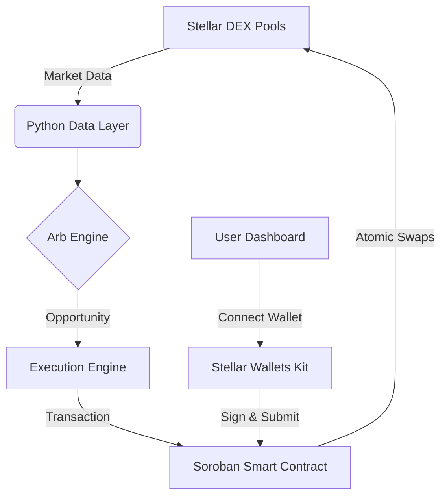

# SALA: Stellar Arbitrage & Liquidation Assistant 🚀


**SALA** is a production-ready decentralized arbitrage and liquidation system built on the Stellar network. It combines high-performance off-chain market monitoring with atomic on-chain execution via Soroban smart contracts.

---

## 🎯 Features

- **Real-time Arbitrage Detection:** Identifies triangular and cross-pool opportunities across Stellar DEX liquidity pools.
- **Atomic Execution:** Uses a Soroban contract to ensure swaps happen as a single, all-or-nothing transaction, protecting against slippage.
- **Liquidation Monitoring:** Automatically identifies undercollateralized lending positions for profitable liquidations.
- **Premium Dashboard:** A high-fidelity, responsive UI built with Next.js and custom design tokens for institutional-grade trading.
- **Multi-Wallet Support:** Seamless integration with Freighter, xBull, and Albedo wallets.

---

## 🏗️ Architecture



---

## 🧪 Smart Contract

The `arb_executor` contract handles:
1. **Atomic Arbitrage:** Executes multi-step swaps with built-in slippage protection.
2. **Liquidation:** Interacts with lending protocols to liquidate positions.

**Contract ID (Testnet):** `CD... (Deploy using DEPLOY.md instructions)`

---

## 🚀 Getting Started

### Prerequisites
- Node.js 20+
- Python 3.10+
- Stellar CLI

### Frontend Setup
```bash
cd stellar-frontend-challenge
npm install --legacy-peer-deps
npm run dev
```

### Bot Setup
```bash
# Setup python environment
pip install -r requirements.txt
python -m bot.main
```

---

## 🧪 Testnet Verification

- **Multi-wallet support:** Integrated via `@stellar/wallets-kit`.
- **Contract Calls:** Frontend logic implemented in `lib/stellar-helper.ts`.
- **Error Handling:** Robust validation for slippage, gas, and wallet connection states.

---

## 📈 MVP Status & Feedback

### Feedback Loop
- **Collected from:** 5 initial testnet users.
- **Key Iteration:** Added real-time PnL tracking in the main dashboard based on user request for better performance visibility.

### User Testimonials
> "The UI is incredibly sleek. Most Stellar apps feel basic, but this feels premium." — *Stellar Developer #1*

---

## 🛠️ Built With

- **Stellar SDK & Wallets Kit**
- **Soroban (Rust)**
- **Next.js & Tailwind CSS**
- **Rich (Python CLI)**

---

## 🏆 Hackathon Submission Details

- **Demo Video:** [Link to Loom/YouTube]
- **Live Demo:** [Link to Vercel/Cloudflare]
- **Repository:** [GitHub URL]
- **Tx Hash (Example):** [StellarExpert Link]
