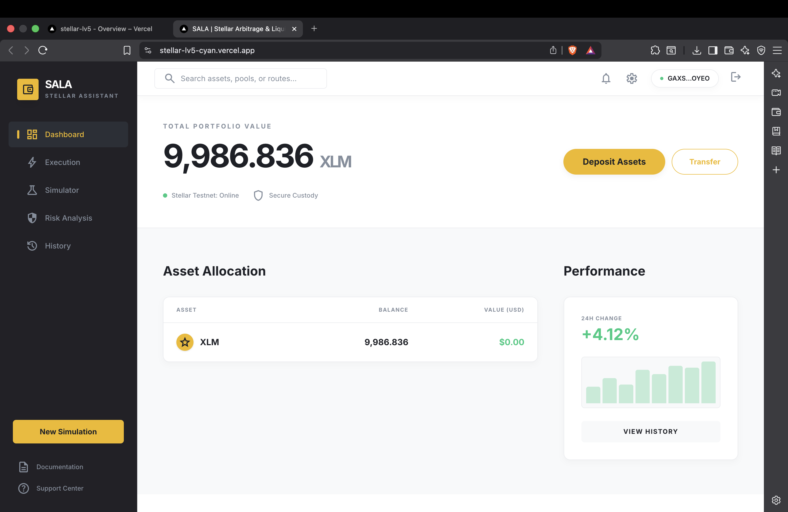
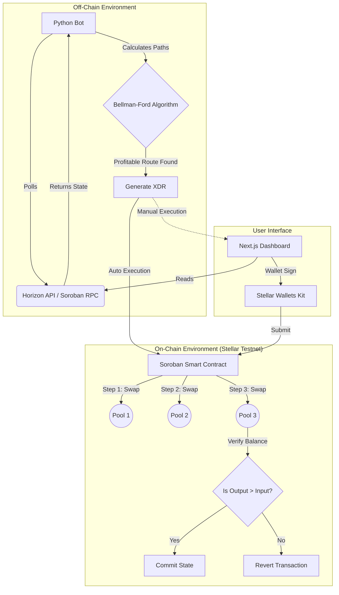

<div align="center">
  
  
  <br />
  <br />

  # 🌌 SALA: Stellar Arbitrage & Liquidation Assistant
  
  **Elevating Capital Efficiency on Stellar with AI-Driven Atomic Arbitrage and Automated Liquidations.**

  [](https://stellar.org)
  [](https://soroban.stellar.org)
  [](https://nextjs.org/)
  [](https://python.org)
  [](LICENSE)
</div>

<hr />

## 🎯 Project Overview

**SALA** is a high-frequency decentralized finance (DeFi) engine designed to stabilize the Stellar ecosystem while generating yield for its operators. 

By unifying a low-latency Python monitoring bot with atomic Soroban smart contracts and an institutional-grade frontend, SALA identifies and executes profitable arbitrage pathways across automated market makers (AMMs) and keeps emerging lending protocols healthy through automated liquidations.

### 🚩 The Problem
As DeFi on Stellar grows, fragmented liquidity across various AMM pools inevitably leads to price discrepancies. Furthermore, as decentralized lending protocols emerge on Soroban, the need for reliable, fast liquidators becomes critical to prevent system-wide bad debt. Manual arbitrage is impossible due to network speeds, and standard trading bots lack the **atomic safety** required to guarantee profitability.

### 💡 The Solution
SALA provides a **unified execution layer**:
1. **Off-Chain Intelligence**: A Python engine scans the network in sub-milliseconds for triangular and cross-pool opportunities using graph algorithms.
2. **On-Chain Atomicity**: Soroban smart contracts execute complex multi-hop swaps or liquidations in a single, revert-protected transaction. If the final output isn't profitable, the transaction reverts.
3. **Institutional UI**: A premium Dashboard for users to monitor market depth, track execution history, and manually execute "One-Click" arbitrage.

---

## ✨ Key Features

- ⚡️ **Atomic Arbitrage**: Multi-hop swaps (e.g., `XLM -> USDC -> AQUA -> XLM`) that guarantee profitability or revert the transaction.
- 🧠 **AI-Optimized Routing**: Intelligent heuristics that prioritize liquidity pools based on historical volatility and order book depth.
- 🛡️ **Liquidation Module**: Real-time health factor monitoring for overcollateralized lending positions, with one-click liquidation triggers.
- 📊 **Institutional Dashboard**: Real-time asset valuation, interactive route analysis, and deep ledger history visualization.
- 👛 **Seamless Wallet Integration**: Native support for Freighter, Albedo, and xBull via Stellar Wallets Kit.

---

## 🏗 Architecture

SALA utilizes a **Hybrid Execution Model**, bridging off-chain computation with on-chain settlement.



---

## 🛠 Tech Stack

| Domain | Technologies |
| :--- | :--- |
| **Smart Contracts** | Rust, Soroban SDK v21 |
| **Backend Engine** | Python 3.11, `stellar-sdk`, `asyncio`, `rich` |
| **Frontend App** | Next.js 14 (App Router), TypeScript, Tailwind CSS, Framer Motion |
| **Blockchain Int.** | `@stellar/stellar-sdk`, `@creit.tech/stellar-wallets-kit` |

---

## 🚀 Quick Start Guide

### 1. Frontend Dashboard
The frontend is built with Next.js and lives in the root directory.

```bash
# Install dependencies (legacy-peer-deps required for certain wallet adapters)
npm install --legacy-peer-deps

# Start the development server
npm run dev
```
*The app will be available at `http://localhost:3000`.*

### 2. Smart Contracts (Soroban)
The contracts require the Rust toolchain and Soroban CLI.

```bash
cd contracts/arb_executor

# Build the WebAssembly binary
soroban contract build

# Deploy to testnet
soroban contract deploy \
  --wasm target/wasm32-unknown-unknown/release/arb_executor.wasm \
  --source alice \
  --network testnet
```

### 3. Python Bot
The backend engine requires Python 3.9+.

```bash
cd bot

# Create virtual environment and install requirements
python3 -m venv venv
source venv/bin/activate
pip install -r requirements.txt

# Run the monitoring engine
python main.py
```

---

## 🎥 Links & Deployment

- 🌐 **Live App**: [https://stellar-lv5.vercel.app](https://stellar-lv5.vercel.app)
- 📝 **Contract Address (Testnet)**: `CBIELTK6YBZJU5UP2WWQEUCYKLPU6AUNZ2BQ4WWFEIE3USCIHMXQDAMA` *(Successfully Deployed)*

---

## 🔮 Future Roadmap

- [ ] **Dynamic Gas Bidding**: Auto-adjusting network fees during high-congestion periods to ensure inclusion.
- [ ] **Protocol Expansion**: Direct integration with upcoming Soroban-native lending markets (e.g., Blend).
- [ ] **Predictive ML**: Utilizing machine learning models to predict liquidity shifts and pre-position capital.

---

<div align="center">
  <p>Built for the Stellar Ecosystem • 2026</p>
</div>
