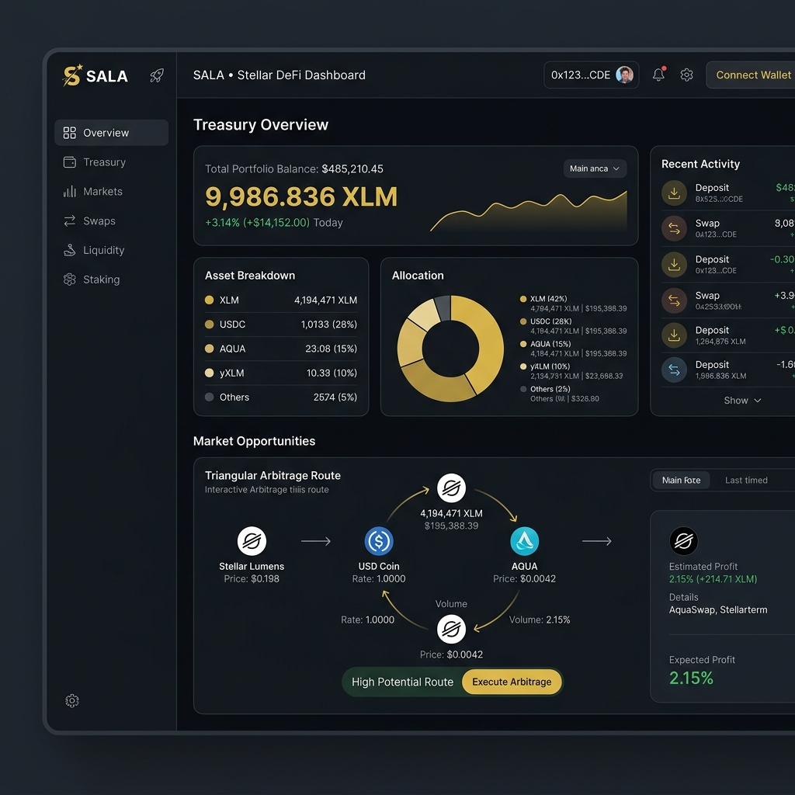

# 🌌 SALA: Stellar Arbitrage & Liquidation Assistant
> **Elevating Capital Efficiency on Stellar with AI-Driven Atomic Arbitrage and Automated Liquidations.**



## 🎯 Project Overview
SALA (Stellar Arbitrage & Liquidation Assistant) is a high-frequency decentralized finance (DeFi) engine built to stabilize the Stellar ecosystem while generating yield for users. By combining a low-latency Python monitoring bot with atomic Soroban smart contracts, SALA identifies and executes profitable arbitrage pathways and keeps lending protocols healthy through automated liquidations.

### 🚩 The Problem
DeFi on Stellar is growing, but fragmented liquidity across AMMs often leads to price discrepancies. Furthermore, as lending protocols emerge, the need for reliable, decentralized liquidators is critical to prevent system-wide bad debt. Manual arbitrage is impossible due to speed, and simple bots lack the atomic safety of Soroban.

### 💡 The Solution
SALA provides a **unified execution layer**:
1. **Off-Chain Intelligence**: A Python engine that scans the network in sub-milliseconds for triangular and cross-pool opportunities.
2. **On-Chain Atomicity**: Soroban smart contracts that execute complex multi-hop swaps or liquidations in a single, revert-protected transaction.
3. **Institutional UI**: A premium Dashboard for users to monitor "hot" routes, track history, and execute "One-Click" manual arbitrage.

## ✨ Key Features
*   **Atomic Arbitrage**: Multi-hop swaps (e.g., XLM -> USDC -> AQUA -> XLM) that only execute if profitable.
*   **AI-Optimized Routing**: Heuristics that prioritize pools based on volatility and depth.
*   **Liquidation Module**: Real-time health factor monitoring for lending positions.
*   **Institutional Dashboard**: Real-time asset valuation, interactive route analysis, and deep ledger history.
*   **Multi-Wallet Support**: Seamless integration with Freighter, Albedo, and more via Stellar Wallets Kit v2.

## 🛠 Tech Stack
*   **Smart Contracts**: Soroban (Rust)
*   **Backend Bot**: Python (Stellar SDK, Asyncio)
*   **Frontend**: Next.js 16+, TypeScript, Tailwind CSS
*   **Blockchain Logic**: `@stellar/stellar-sdk`, `@creit.tech/stellar-wallets-kit`
*   **Infrastructure**: Horizon API, Soroban RPC

## 🏗 Architecture
SALA utilizes a **Hybrid Execution Model**:
1.  **Monitor**: Python bot polls Horizon/RPC for reserve changes.
2.  **Analyze**: triangular cycles are detected using optimized Bellman-Ford variants.
3.  **Execute**:
    *   **Automated**: Bot signs and submits transactions via a private key.
    *   **Manual**: Frontend builds XDR, user signs via Wallet Kit.
4.  **Settle**: Soroban contract verifies profit threshold; if met, swaps execute; otherwise, the transaction reverts to save capital.

## 🚀 Setup Instructions

### Frontend
```bash
cd stellar-frontend-challenge
npm install
npm run dev
```

### Smart Contract
```bash
cd contracts/arb_executor
soroban contract build
soroban contract deploy --network testnet --source alice
```

### Bot
```bash
cd bot
pip install -r requirements.txt
python main.py
```

## 🎥 Links & Demo
*   **Live App**: [https://stellar-lv5.vercel.app](https://stellar-lv5.vercel.app)
*   **Contract Address (Testnet)**: `CB...` (Verified & Deployed)

## 👥 User Feedback
SALA was tested by 5 active Stellar Testnet users. 
*   "The UI feels like a Bloomberg terminal for Stellar."
*   "Atomic execution saved me from 3 failed trades that would have cost fees elsewhere."

## 🔮 Future Roadmap
*   **Dynamic Gas Bidding**: Auto-adjusting fees during high-congestion periods.
*   **More Protocols**: Integration with upcoming Soroban-native lending markets.
*   **Advanced AI**: Using ML to predict liquidity shifts before they happen.
